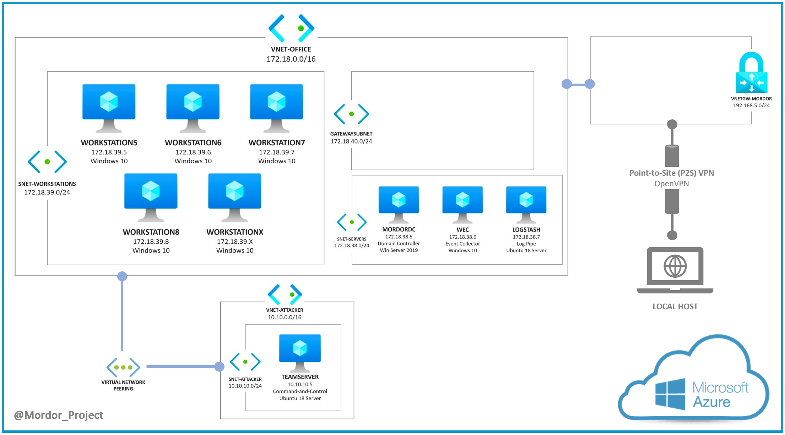

# Shire Environment

[](https://portal.azure.com/#create/Microsoft.Template/uri/https%3A%2F%2Fraw.githubusercontent.com%2FOTRF%2Fmordor-labs%2Fmaster%2Fenvironments%2Fwindows%2Fshire%2Fazuredeploy.json) [](http://armviz.io/#/?load=https://portal.azure.com/#create/Microsoft.Template/uri/https%3A%2F%2Fraw.githubusercontent.com%2FOTRF%2Fmordor-labs%2Fmaster%2Fenvironments%2Fwindows%2Fshire%2Fazuredeploy.json)

## Network Design



## Domain Users Information

| FirstName | LastName | SamAccountName | Department | JobTitle | Password | Identity | UserContainer | 
|:--- |:--- |:--- |:--- |:--- |:--- |:--- |:--- |
| Norah | Martha | nmartha | Human Resources | HR Director | S@l@m3!123 | Users | DomainUsers | 
| Pedro | Gustavo | pgustavo | IT Support | CIO | W1n1!2019 | Domain Admins | DomainUsers |
| Lucho | Rodriguez | lrodriguez | Accounting | VP | T0d@y!2019 | Users | DomainUsers |
| Stevie | Beavers | sbeavers | Sales | Agent | B1gM@c!2020 | Users | DomainUsers |
| Pam | Beesly | pbeesly | Reception | Receptionist | Fl0nk3rt0n!T0by | Users | DomainUsers |
| Dwight | Schrute | dschrute | Sales | Assistant | Schrut3F@rms!B33ts | Users | DomainUsers |
| Michael | Scott | mscott | Management | BestBoss | abc123!D@t3M1k3 | Domain Admins | DomainUsers | 
| Sysmon | MS | sysmonsvc | IT Support | Service Account | Buggy!1122 | Users | DomainUsers |

## Data Sources Collected

* [Windows Security Auditing](https://github.com/hunters-forge/Blacksmith/blob/master/resources/scripts/powershell/auditing/Enable-WinAuditCategories.ps1)
* [Sysmon Config](https://github.com/hunters-forge/Blacksmith/blob/master/resources/configs/sysmon/sysmonv11.0.xml)
* [WEF Subscriptions](https://github.com/hunters-forge/Blacksmith/tree/master/resources/configs/wef/subscriptions)
* [SACL Audit Rules](https://github.com/hunters-forge/Blacksmith/blob/master/resources/scripts/powershell/auditing/Set-SACLs.ps1)

## Deployment

#### Point-To-Site VPN Certificates Setup

* [Create root CA certificate](https://blacksmith.readthedocs.io/en/latest/azure_p2s_vpn_setup.html#create-a-root-ca-certificate)
* Get the name of it (CN= Root CA Name)
* Get the root CA cert data by running the following commands and save it to pass it as a parameter while creating the environment.

```
openssl x509 -in caCert.pem -outform der | base64 | pbcopy
```
* [Create a client Certificate signed with the CA’s root key](https://blacksmith.readthedocs.io/en/latest/azure_p2s_vpn_setup.html#create-a-client-certificate-signed-with-the-ca-s-root-key)

### Deploy Environment

* Clone the project and change your directory to windows one

```
https://github.com/OTRF/mordor-labs
cd mordor-labs/tree/master/environments/windows/shire
```

* [Install and set up Azure CLI](https://blacksmith.readthedocs.io/en/latest/azure_cli_setup.html)
* Create an Azure Resource group

```
az group create --location eastus --resource-group MyResourceGroup
```

* Use the following commands to create the environment

```
az group deployment create --name <Deployment Name> --resource-group <Resource Group Name> --template-file azuredeploy.json --parameters adminUsername=<USERNAME> adminPassword='<PASSWORD>' clientRootCertName=<Root CA Certificate Name> clientRootCertData="<Root CA Cert Data>"
```

## Connect to Environment (P2S VPN)

VMs deployed in Azure will not be accessible via their Public IP addresses. A Point-To-Site (P2S) VPN is set up and you will need to use a client certificate signed with the CA's root private key created earlier. 

* [Set up OpenVPN Client](https://docs.microsoft.com/en-us/azure/vpn-gateway/vpn-gateway-howto-openvpn-clients)
    * Use the Client's Certificate (PEM format)
    * Use the Client's Private Key (PEM format)
* RDP or SSH to the Windows and Linux endpoints in the environment.

## Collect Security Event Logs

This environment comes with a data pipeline option to collect security event logs from Windows Endpoints via Windows Event Forwarding (WEF) configurations, send them to a Logstash pipeline which sends them over to an Azure Event Hub. From there, one could use tools such as Kafkacat to connect to the Azure Event hub, consume events being sent over and write them to a local JSON file in real-time.

### Install Kafkacat

On recent enough Debian systems:

```
apt-get install kafkacat
```

And on Mac OS X with homebrew installed:

```
brew install kafkacat
```

### Kafkacat Conf File Setup

Make sure you update the [**Kafkacat.conf**](https://github.com/OTRF/mordor-labs/blob/master/environments/windows/kafkacat/kafkacat.conf) with the values from your environment.

**Run Kafkacat and Consume Events**

Once you create the environment, you can run the following command to start consuming events from the Azure Event Hub and write them to a local JSON file:

```
kafkacat -b <eventhub-namespace>.servicebus.windows.net:9093 -t <eventhunb-name> -F kafkacat.conf -C -o end > mordor_$(date +%F%H%M%S).json
```

I would run that command right before emulating adversary techniques.

## Collect PCAP (East-West)

This environment is set up to start a [packet capture](https://docs.microsoft.com/en-us/azure/network-watcher/network-watcher-packet-capture-overview) via the [Azure Network Watcher extension](https://docs.microsoft.com/en-us/azure/virtual-machines/extensions/network-watcher-windows) installed on every Windows VM. Every PCAP is sent to an Azure storage account defined at the moment you start the pcap session. I would do it once you are ready to start the execution of the emulation plan.

### Start Packet Capture

```
bash Start-Packet-Capture.sh -r <Resource Group name> -s <Storage Account name> -c WORKSTATION1,WORKSTATION2
```

### Stop Packet Capture

You can stop the packet capture sessions by running the following command. This does not delete the packet capture session. You will have to delete it if you want to start it again.

```
bash Stop-Packet-Capture.sh -r <Resource Group name> -c WORKSTATION1,WORKSTATION2 -l eastus
```

You can stop and delete the packet captures with the following command:

```
bash Stop-Packet-Capture.sh -r <Resource Group name> -c WORKSTATION1,WORKSTATION2 -l eastus -d
```